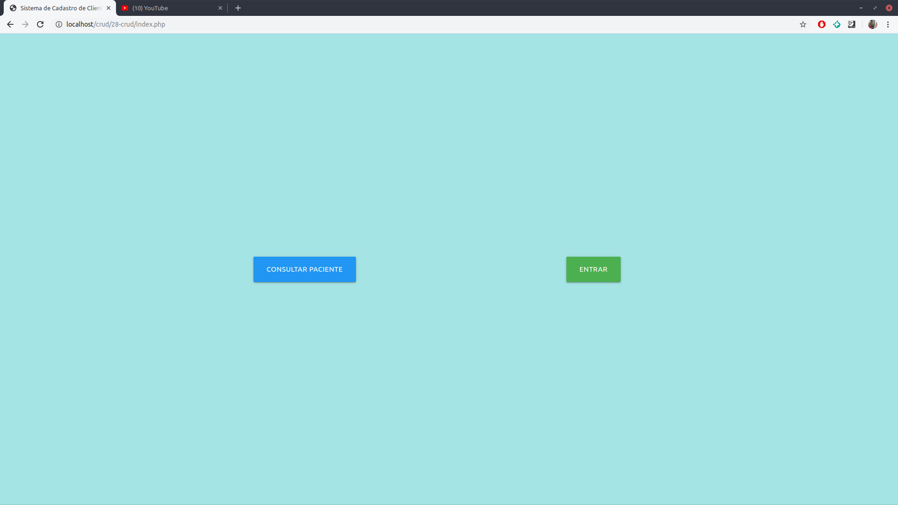
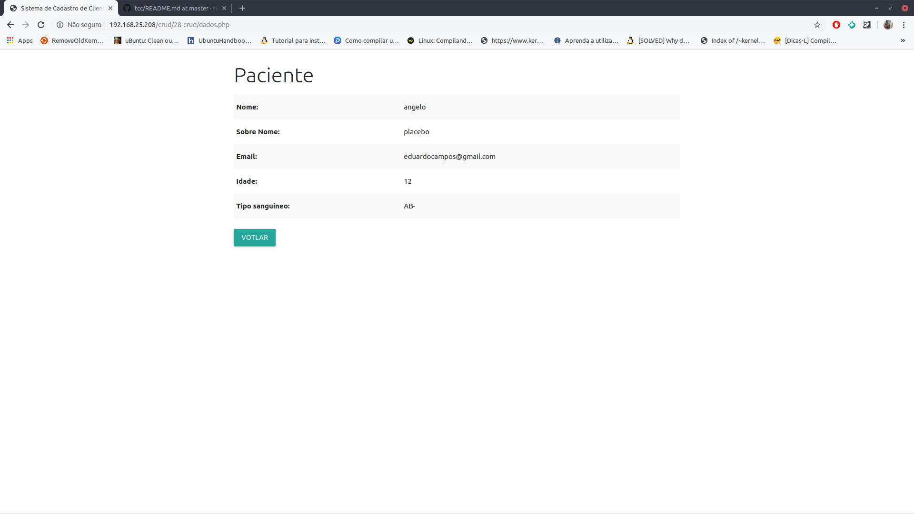
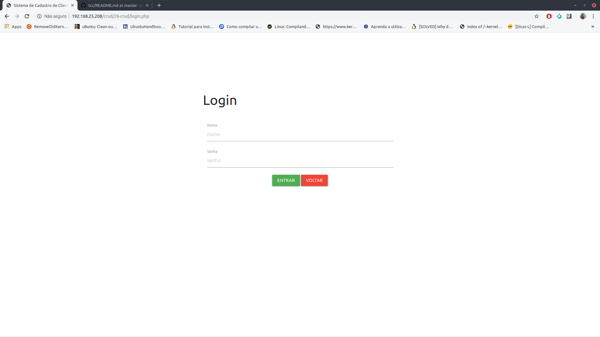
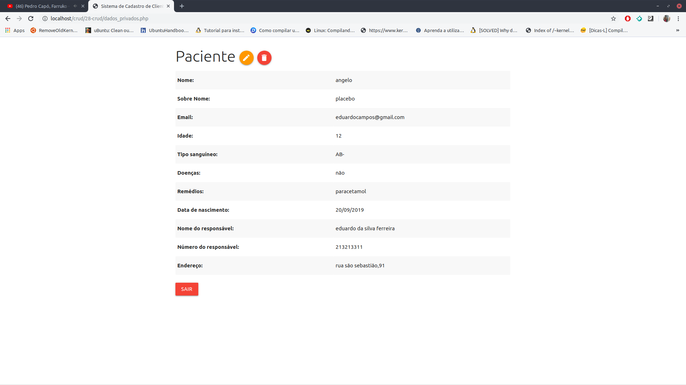
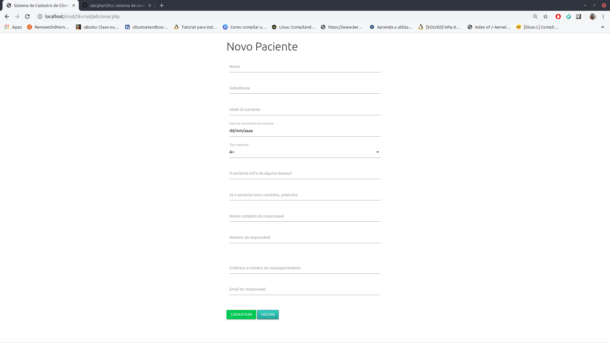
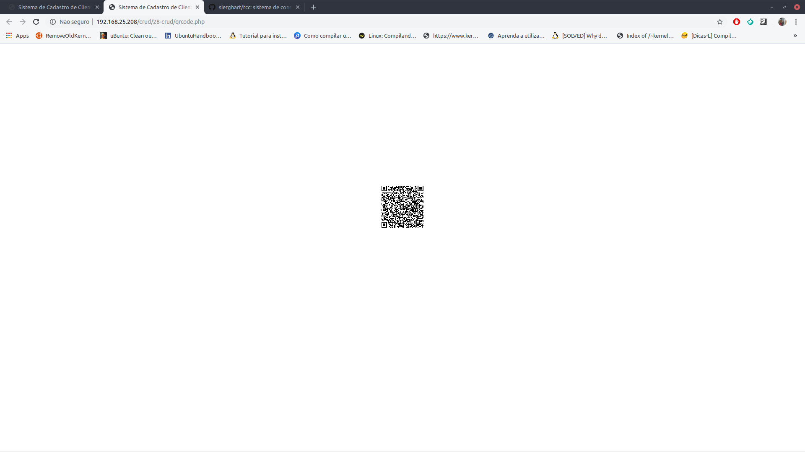

# Sistema de cadastro e consulta para crianças do ensino fundamental usando RFID

## Feito por: Islan Pedro e Edmilson Júnior

sistema de consulta para escolas

Usado como projeto de conclusão de curso dos criadores.

proporcionando uma consultar por nome e QRcode.

projeto direcionado para escolas, mas pode ser utilizados em vários ambientes.

Inclui:
Cadastro;
Consulta básica;
Consulta completa;
modificação de dados;

### Index do site:

* *Cor de background sujeita a mudança, assim como o background de todas as outras páginas.*--> :question:

### Consulta normal:

* *O formato que as informações serão mostradas mudará para tabela como a consulta do administrador* :heavy_check_mark:

### Login:

### Painel administrativo:

### Consulta administrador:

* *Ainda falta adicionar algumas informações sobre o paciente.*--> :question:

### Cadastro:

### QrCode:

* *O tamanho do QrCode ainda pdoe sofrer alterações.*

# Objetivos a alcançar:

 **1.** Fazer a integração do cadastro com uma API de criação de QRcode; :heavy_check_mark:
 
  **2.** Fazer a integração do cadastro com o cartão RFID usando a ESP32; :heavy_check_mark:
  
 OBS: O controle de acesso com log foi feito e testado e está funcionando, mas não foi apresentado na defesa do trabalho.
 OBS2: Algumas imagens estão desatualizadas.

